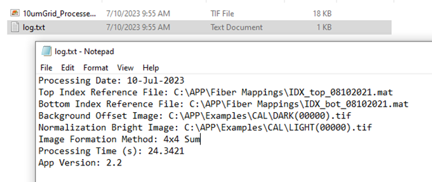

# sHAPR Processor
MATLAB App for computational reconstruction of raw sHAPR images

# Using the App

This app runs Windows 10 using MATLAB and has been tested on versions 2019a and 2021a. Install the app in the MATLAB App tab, which should take less than a minute. After installing and opening the app, this is the initial interface:

There are selection interfaces for the data folder, fiber index mappings, background image, and the normalization image. First, select the fiber index mapping files. The fiber index mapping is split into two parts, the "top" and "bottom" files, which contain the corresponding indices on the fiber coupler input array for the top and bottom rows of fibers on the fiber coupler output array, respectively. These files are provided in the "Fiber Mappings" folder.

Afterwards, the background and normalization calibration image can be selected. These are optional, and the reconstruction can be run without selecting these files. The background image is a dark image taken with no light and is used for background subtraction. The normalization image is an image taken of uniform illumination and is used to correct for the differences in transmission of individual optical fibers. The normalization image cannot be set without first providing a background image. These images are typically re-taken for each experimental session. A set of calibrations is provided in the "Examples/CAL" folder.

After selecting these options, the interface will look like this:

Next, select the directory containing the sample images to process. The app will populate the preview list with any TIF format files in the directory. These TIF files can be single images or multi-frame image stacks.

Selecting a file to preview will display the reconstruction in the lower-right box. The slide located below the image can be used to scroll through frames if the input image is an image stack.

The initial configuration file selections can be changed on-the-fly, and the preview will be updated in real-time, as shown in the following example where the bottom fiber mapping file is changed to be equal to the top fiber file.

The final setting is the "Image formation mode" which should be set to "4x4 sum", where it will sum together 4x4 pixel regions occupied by a single fiber. There are other formation modes available, but they are experimental and were not used in any data presented in the manuscript.

Once all settings are ready, press the RUN button to process all data in the samples directory. The output will be located in the selected samples directory in a folder prefixed "BATCH". If the same directory is run multiple times, each output folder name will be indexed by 1.

The BATCH output folder also contains an information file which documents the processing date, processing configurations, and the total time elapsed.

# Performance information

This app has been tested on MATLAB version 2019a and 2021a. It took 694 seconds to process 9.4GB of image stacks on a Intel(R) Xeon(R) W-2145 CPU @ 3.70GHz with 512GB of RAM.

# Dependency information

This app requires the MATLAB parallel computing toolbox
This app also includes the parfor_wait function created by Yun Pu, and the Fast_Tiff_Write library

# Additional licensing information

This app utilizes the parfor_wait function created by Yun Pu under the BSD 3-Clause license.
This app utilizes the Fast_Tiff_Write library under the GPL-3.0 license.